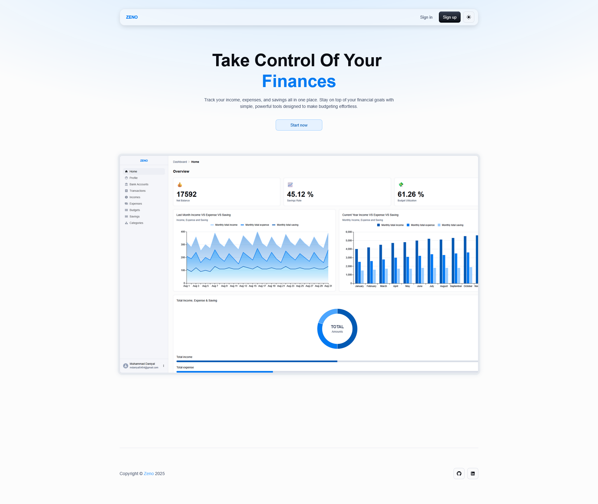

# Zeno Finance Tracker

A Full Stack finance management application that helps individuals stay in control of their money.
Track income, expenses, savings, budgets, and categories. All visualized through an interactive dashboard with charts.

<hr style="border: 0; height: 2px; background: linear-gradient(to right, #FF6384, #36A2EB);" />


<hr style="border: 0; height: 2px; background: linear-gradient(to right, #FF6384, #36A2EB);" />



<hr style="border: 0; height: 2px; background: linear-gradient(to right, #FF6384, #36A2EB);" />

## Features

- Authentication & Authorization: Secure register/login with JWT access & refresh tokens (HTTP-only cookies)
- OTP Email Verification: Secure verification flow powered by Brevo
- Bank Accounts Management: Create real or virtual accounts to track money
- Expense Tracking: Categorize and set spending limits to avoid overspending
- Income Tracking: Record multiple income streams
- Dashboard & Charts: Visualize financial health through charts
- Budgets: Create and manage one active budget with timeframes
- Savings Accounts: Track progress toward saving objectives
- Email Reminders: Automated notifications via Brevo
- Search & Filter: Easily explore financial records in tabular form

## Tech Stack

### Frontend

- React (Vite)
- Material UI (MUI)
- Day.js
- MUI X Charts & Data Grid
- Redux Toolkit
- React Router v7

### Backend

- Node.js + Express.js
- PostgreSQL + Sequelize ORM
- JWT (with HTTP-only cookies)
- Brevo (for mailing)
- bcryptjs (password hashing)

### Dev Tools

Nodemon, ESLint, Prettier, PgAdmin, Postman

## Deployment

- Frontend (Vercel): [https://zeno-finance-tracker-client.vercel.app](https://zeno-finance-tracker-client.vercel.app)
- Backend (Render): [https://zeno-backend-uf2p.onrender.com](https://zeno-backend-uf2p.onrender.com/)
- Database (Neon): PostgreSQL hosted on Neon
- Mailing Service: Brevo

## Getting Started

### Clone the repo
```
git clone https://github.com/[username]/Zeno.git
cd Zeno
```

### Backend Setup
```
cd backend
npm install
```
Create a .env file based on .env.example:
```
# ==========================
# Development Environment
# ==========================
PORT=5000
NODE_ENV=development

# Local PostgreSQL
DB_HOST=localhost
DB_PORT=5432
DB_USER=your_local_user
DB_PASS=your_local_password
DB_NAME=zeno_dev

# JWT Secrets
ACCESS_TOKEN_SECRET=your_dev_access_secret
REFRESH_TOKEN_SECRET=your_dev_refresh_secret
ACCESS_TOKEN_EXPIRY=15m
REFRESH_TOKEN_EXPIRY=7d

# Brevo (development)
SENDER_EMAIL=dev@example.com
BREVO_API_KEY=your_brevo_api_key


# ==========================
# Production Environment
# ==========================
PORT=8080
NODE_ENV=production

# Neon PostgreSQL
DB_URL=your_neon_connection_string

# JWT Secrets
ACCESS_TOKEN_SECRET=your_prod_access_secret
REFRESH_TOKEN_SECRET=your_prod_refresh_secret
ACCESS_TOKEN_EXPIRY=15m
REFRESH_TOKEN_EXPIRY=7d

# Frontend (deployed on Vercel)
CLIENT_URL=https://your-frontend.vercel.app

# Brevo (production)
SENDER_EMAIL=dev@example.com
BREVO_API_KEY=your_brevo_api_key


```
Start backend:
```
npm run dev   # for development
npm start     # for production
```

### Frontend Setup

```
cd frontend
npm install
npm run dev   # development
npm run build # production build
```

## Database

PostgreSQL managed with Sequelize ORM. You can manage your database visually with PgAdmin. Supports models for:

- User
- Transaction
- Saving
- OTP
- Income
- Expense
- Category
- Budget
- Account

Zeno Finance Tracker helping you master your money.
